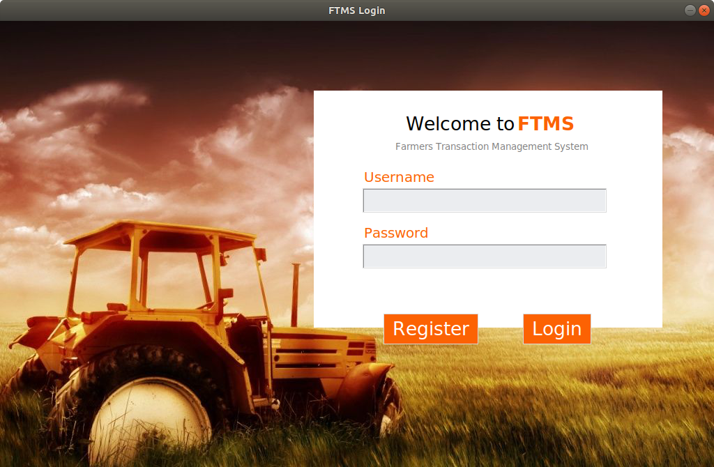
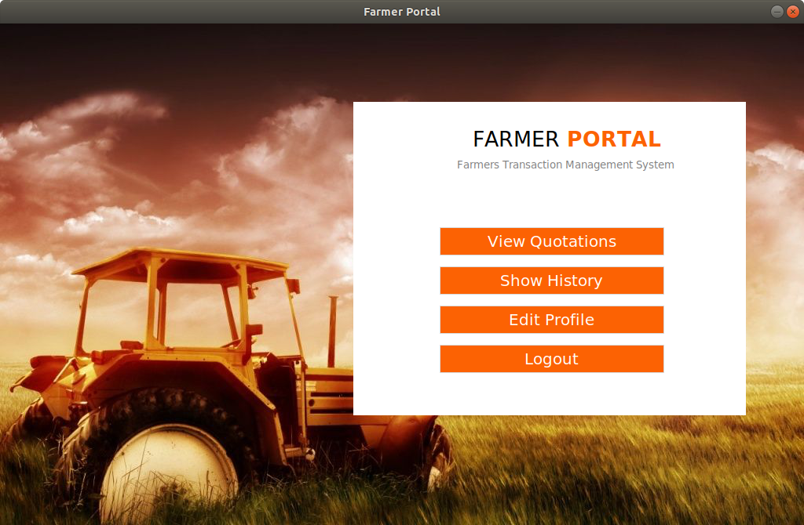
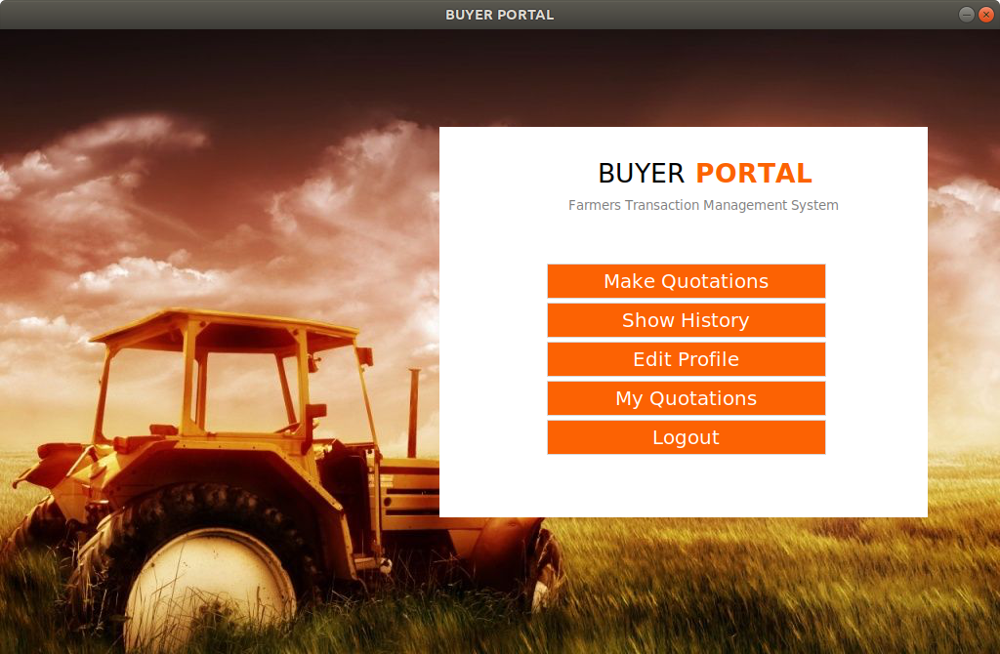

# FTMS - Farmers Transaction Management System

An user friendly python-tkinter and SQL based application that allows easy communication between farmers and crop
buyers during the purchasing phase. Developed as a mini project for CS251 - Database Systems.

Contributors:    

Pranshu - [Pranshu-S](https://github.com/Pranshu-S)   
Raghavendra  - [Raghavendra44](https://github.com/Raghavendra44)   
Sankarsh - [sankronaldo](https://github.com/sankronaldo)   
Yuvasankar - [Yuv-B](https://github.com/Yuv-B)     


## 1. Setup and Run:   

### 1.1 Make sure the following requirements are satisfied - 

    Python -  3.6.9  
    Tkinter - 8.6
    Pillow -  8.1.2
    Sqlite3 - 2.6.0

### 1.2 Clone the repository:

```
git clone https://github.com/Pranshu-S/FTMS
cd FTMS
```

### 1.3 Run the application:

Since the application is a single python application, it can be run from the command shell by running the following - 
```
python FTMS.py
```

## 3. Results and Submission:

### 3.1 Starup Page -    


This page handles all the incoming users. Being the startup page, it provides users with options to Login and Register as new user.

### 3.2 Farmer Portal - 


This page handles all incoming farmers. It provides them with options to view avialable quotations from farmers, past history of purchase, edit profile contents.

### 3.3 Buyer Portal - 


This page handles all incoming buyers. It provides them the ability to make quotations, show past history of transactions, edit profile contents as well as view current active quotations.

### Documentation

Proposal - [Link](https://github.com/Pranshu-S/FTMS/blob/main/Proposal/Proposal.pdf)    

Report - [Link](https://github.com/Pranshu-S/FTMS/blob/main/Report/FinalReport.pdf)


